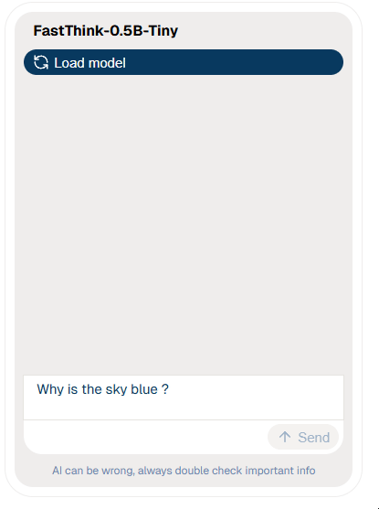

<p align="center"></p>

<a target="_blank" href="https://discord.gg/SxTp53NQ"></a>

# llmini.js

A comprehensive TypeScript library providing easy-to-use AI/ML components for web applications, powered by Hugging Face Transformers and ONNX models running in the browser.

## Features

- 🤖 **Chat Interface** - Interactive chat with various language models
- 🎤 **Audio Transcription** - Convert speech to text using advanced models
- 🖼️ **Image Analysis** - Analyze and describe images with vision models
- 🔊 **Text-to-Speech** - Generate natural speech from text
- 🌐 **Browser-based** - Runs entirely in the browser using WebGPU/WASM ( Node.js support in the work )
- ⚡ **Web Workers** - Non-blocking processing with worker threads
- 📱 **React Components** - Ready-to-use React components
- 🔒 **Privacy-First** - All processing happens locally in the browser
- 📄 **Document Analysis** - Question answering on documents and images
- 🎯 **Object Detection** - Detect and classify objects in images
- 📊 **Image Classification** - Classify images with various models
- 🎨 **Image Generation** - Generate images from text prompts
- 💾 **Offline Capable** - Works without internet connection once loaded

## Installation

```bash
npm install llmini.js
```

> [!NOTE]
> If you got dual GPU, your browser may be using the standard gpu (Intel for example) for power saving reasons, you need to switch to NVIDIA/AMD's GPU to get the best performance. Here is how to switch it on Windows 10:

<p align="center"></p>

## Roadmap

1. [ ] Refactor code highlighter
1. [ ] Add and test Node.js support
1. [ ] Add render props for custom component usage
1. [ ] Test more models
1. [ ] Add more categories

## System requirements

### Browser Support

- WebGPU: Chrome 113+, Edge 113+, Safari 18+
- WebAssembly: All modern browsers
- Web Workers: All modern browsers

### Hardware Requirements

- Memory: 4GB+ RAM recommended
- GPU: WebGPU-compatible GPU for best performance
- Storage: Models are cached locally (100MB - 2GB per model)

## Available categories

| Name                               | Description                                    |
| ---------------------------------- | ---------------------------------------------- |
| **🗣️ audio-text-to-text**          | Convert speech to text using advanced models   |
| **💬 chat**                        | Interactive chat with various language models  |
| **📰 image-text-to-text**          | Analyze and describe images with vision models |
| **🔊 text-to-speech**              | Generate natural speech from text              |
| **❔ document-question-answering** | Question answering on documents and images     |
| **⬜ object-detection**            | Detect and classify objects in images          |
| **📦 image-classification**        | Classify images with various models            |
| **📷 visual-question-answering**   | Question answering on documents and images     |
| **🧊 depth-estimation**            | Estimate depth from images                     |

## Available models

| Name                                             | Tested | Notes                                              |
| ------------------------------------------------ | ------ | -------------------------------------------------- |
| **audio-text-to-text**                           |
| Voxtral-Mini-3B-2507-ONNX                        | ✅     |                                                    |
| ultravox-v0_5-llama-3_2-1b-ONNX                  | ✅     | Fastest                                            |
| Voxtral-Mini-3B-2507_timestamped                 | ✅     |                                                    |
| **chat**                                         |
| Voxtral-Mini-3B-2507-ONNX                        | ✅     |                                                    |
| Qwen2.5-0.5B-Instruct                            | ✅     |                                                    |
| Qwen2.5-Coder-0.5B-Instruct                      | ✅     |                                                    |
| Qwen3-0.6B-ONNX                                  | ✅     |                                                    |
| Qwen1.5-0.5B-Chat-ONNX                           | ✅     |                                                    |
| Phi-3.5-mini-instruct-onnx-web                   | ✅     |                                                    |
| Llama-3.2-1B-Instruct-q4f16                      | ✅     |                                                    |
| SmolLM2-135M-Instruct                            | ✅     |                                                    |
| SmolLM2-360M-Instruct                            | ✅     |                                                    |
| SmolLM2-1.7B-Instruct                            | ✅     |                                                    |
| SmolLM3-3B-ONNX                                  | ✅     |                                                    |
| DeepSeek-R1-Distill-Qwen-1.5B-ONNX               | ✅     |                                                    |
| deepseek-coder-1.3b-instruct-ONNX                | ✅     |                                                    |
| FastThink-0.5B-Tiny                              | ✅     |                                                    |
| Janus-Pro-1B-ONNX                                | ✅     | Multimodal                                         |
| Janus-1.3B-ONNX                                  | ✅     |                                                    |
| LFM2-1.2B-ONNX                                   | ✅     |                                                    |
| ZR1-1.5B-ONNX                                    | ✅     |                                                    |
| **depth-estimation**                             |
| depth-anything-small-hf                          | ✅     |                                                    |
| depth-anything-v2-small                          | ✅     | Fastest, no major difference in quality with large |
| dpt-large                                        | ❌     |                                                    |
| dpt-hybrid-midas                                 | ❌     |                                                    |
| depth-anything-v2-base                           | ✅     |                                                    |
| depth-anything-base-hf                           | ✅     |                                                    |
| DepthPro-ONNX                                    | ❌     |                                                    |
| depth-anything-large-hf                          | ✅     |                                                    |
| depth-anything-v2-large                          | ✅     |                                                    |
| metric3d-vit-small                               | ❌     |                                                    |
| glpn-kitti                                       | ❌     |                                                    |
| glpn-nyu                                         | ❌     |                                                    |
| dpt-dinov2-base-kitti                            | ❌     |                                                    |
| metric3d-vit-large                               | ❌     |                                                    |
| dpt-dinov2-large-nyu                             | ❌     |                                                    |
| DepthSmall                                       | ❌     |                                                    |
| dpt-dinov2-small-kitti                           | ❌     |                                                    |
| promptda_vits_transparent_hf                     | ❌     |                                                    |
| promptda_vits_hf                                 | ❌     |                                                    |
| metric3d-vit-giant2                              | ❌     |                                                    |
| dpt-dinov2-small-nyu                             | ❌     |                                                    |
| dpt-dinov2-base-nyu                              | ❌     |                                                    |
| dpt-dinov2-large-kitti                           | ❌     |                                                    |
| **document-question-answering**                  |
| donut-base-finetuned-docvqa                      | ✅     |                                                    |
| **image-classification**                         |
| vit-base-nsfw-detector                           | ✅     |                                                    |
| vit-age-classifier                               | ✅     |                                                    |
| detection-model-3-ONNX                           | ✅     |                                                    |
| detection-model-5-ONNX                           | ✅     |                                                    |
| detection-model-7-ONNX                           | ✅     |                                                    |
| dinov2-with-registers-small-with-attentions      | ❌     |                                                    |
| resnet-18                                        | ✅     |                                                    |
| resnet-152                                       | ✅     |                                                    |
| mobilenetv4s-webnn                               | ✅     |                                                    |
| mobilenet_v2_1.4_224                             | ✅     |                                                    |
| convnext-tiny-224                                | ❌     |                                                    |
| resnet-50-ONNX                                   | ✅     |                                                    |
| gender-classification-ONNX                       | ✅     |                                                    |
| facial_emotions_image_detection                  | ✅     |                                                    |
| fairface_gender_image_detection-ONNX             | ✅     |                                                    |
| fairface_age_image_detection-ONNX                | ✅     |                                                    |
| Fire-Detection-Engine-ONNX                       | ❌     |                                                    |
| Vit-Mature-Content-Detection-ONNX                | ✅     |                                                    |
| **image-text-to-text**                           |
| SmolVLM-256M-Instruct                            | ✅     |                                                    |
| SmolVLM-500M-Instruct                            | ✅     |                                                    |
| sm_doc                                           | ❌     |                                                    |
| Florence-2-large                                 | ✅     |                                                    |
| FastVLM-0.5B-ONNX                                | ✅     |                                                    |
| **object-detection**                             |
| detr-resnet-50                                   | ✅     |                                                    |
| yolos-tiny                                       | ❌     |                                                    |
| yolos-base                                       | ❌     |                                                    |
| gelan-c_all                                      | ❌     |                                                    |
| yolos-small-300                                  | ❌     |                                                    |
| yolov10m                                         | ❌     |                                                    |
| yolov9-c_all                                     | ❌     |                                                    |
| yolov9-c                                         | ❌     |                                                    |
| detr-resnet-101                                  | ❌     |                                                    |
| yolos-small-person                               | ❌     |                                                    |
| table-transformer-detection                      | ❌     |                                                    |
| yolov10n                                         | ❌     |                                                    |
| rtdetr_v2_r34vd-ONNX                             | ❌     |                                                    |
| yolos-small                                      | ❌     |                                                    |
| yolov10s                                         | ❌     |                                                    |
| rfdetr_small-ONNX                                | ❌     |                                                    |
| rfdetr_nano-ONNX                                 | ❌     |                                                    |
| table-transformer-structure-recognition          | ❌     |                                                    |
| rfdetr_medium-ONNX                               | ❌     |                                                    |
| yolov8x-doclaynet_ONNX                           | ❌     |                                                    |
| yolov10x                                         | ❌     |                                                    |
| yolov10b-doclaynet_ONNX_document-layout-analysis | ❌     |                                                    |
| yolos-small-dwr                                  | ❌     |                                                    |
| table-transformer-structure-recognition-v1.1-fin | ❌     |                                                    |
| yolov10b                                         | ❌     |                                                    |
| yolov10m-doclaynet_ONNX_document-layout-analysis | ❌     |                                                    |
| rfdetr_base-ONNX                                 | ❌     |                                                    |
| yolov10l                                         | ❌     |                                                    |
| yolov9-e                                         | ❌     |                                                    |
| rtdetr_v2_r18vd-ONNX                             | ❌     |                                                    |
| **text-to-speech**                               |
| Kokoro-82M-v1.0-ONNX                             | ✅     | Webgpu may cause noise in audio                    |
| OuteTTS-0.2-500M                                 | ✅     | The best model, slower                             |
| **visual-question-answering**                    |
| Janus-Pro-1B-ONNX                                | ✅     | Alternative to chat mode                           |

## Quick Start

### React Component (Recommended)

```tsx
import { ChatComponent } from "llmini.js/categories/chat";

function App() {
  return (
    <ChatComponent
      modelName="FastThink-0.5B-Tiny"
      defaultPrompt="Why is the sky blue?"
    />
  );
}
```

### SDK usage (Advanced)

```tsx
import { ChatSDK } from "llmini.js/categories/chat";

const chatSDK = new ChatSDK("FastThink-0.5B-Tiny", {
  withWorker: true,
  device: "webgpu",
  callbacks: {
    onProgressChange: (progress) => console.log(progress),
    onMessagesChange: (messages) => console.log(messages),
  },
});

await chatSDK.load();
await chatSDK.sendMessage({ prompt: "Why is the sky blue?" });
```

## React Components Examples

The library provides a wide range of React components for various AI/ML tasks. Here are some examples:

<table>
  <tr>
    <th>Example</th>
    <th>Preview</th>
  </tr>
  <tr>
    <th colspan="2">Chat text generation</th>
  </tr>
  <tr>
    <td>

```tsx
import { ChatComponent } from "llmini.js/categories/chat";

function App() {
  return (
    <ChatComponent
      modelName="FastThink-0.5B-Tiny"
      defaultPrompt="Why is the sky blue?"
    />
  );
}
```

</td>
    <td width="400px" >
      
    </td>
  </tr>
   <tr>
    <th colspan="2">Chat image generation</th>
  </tr>
   <tr>
    <td width="400px" >

```tsx
import { ChatComponent } from "llmini.js/categories/chat";

function App() {
  return (
    <ChatComponent
      modelName="Janus-Pro-1B-ONNX"
      defaultPrompt={`A cute and adorable baby 
    fox with big brown eyes
    autumn leaves in the background 
    enchanting,immortal,fluffy, shiny mane,
    Petals,fairyism,unreal engine 5 and 
    Octane Render,highly detailed, 
    photorealistic, cinematic, natural colors.`}
    />
  );
}
```

</td>
    <td>
      
    </td>
  </tr>
  <tr>
    <th colspan="2">Chat image parsing</th>
  </tr>
   <tr>
    <td>

```tsx
import { ChatComponent } from "llmini.js/categories/chat";

function App() {
  return (
    <ChatComponent
      modelName="Janus-Pro-1B-ONNX"
      defaultPrompt="Describe the following image"
    />
  );
}
```

</td>
    <td>
      
    </td>
  </tr>
  <tr>
    <th colspan="2">Code generation</th>
  </tr>
   <tr>
    <td>

```tsx
import { ChatComponent } from "llmini.js/categories/chat";

function App() {
  return (
    <ChatComponent
      modelName="Qwen2.5-Coder-0.5B-Instruct"
      defaultPrompt="Generate a typescript fibonacci function"
    />
  );
}
```

</td>
    <td>
      
    </td>
  </tr>
  <tr>
    <th colspan="2">Audio transcription</th>
  </tr>
   <tr>
    <td>

```tsx
import { AudioTextToTextComponent } from "llmini.js/categories/audio-text-to-text";

function App() {
  return (
    <AudioTextToTextComponent modelName="ultravox-v0_5-llama-3_2-1b-ONNX" />
  );
}
```

</td>
    <td>
      
    </td>
  </tr>
  <tr>
    <th colspan="2">Image object detection</th>
  </tr>
   <tr>
    <td>

```tsx
import { ObjectDetectionComponent } from "llmini.js/categories/object-detection";

function App() {
  return <ObjectDetectionComponent modelName="detr-resnet-50" />;
}
```

</td>
    <td>
      
    </td>
  </tr>
  <tr>
    <th colspan="2">Text to speech</th>
  </tr>
   <tr>
    <td>

```tsx
import { TextToSpeechComponent } from "llmini.js/categories/text-to-speech";

function App() {
  return (
    <TextToSpeechComponent
      defaultText="Hello, my name is John Doe"
      modelName="Kokoro-82M-v1.0-ONNX"
    />
  );
}
```

</td>
    <td>
      
    </td>
  </tr>
  <tr>
    <th colspan="2">Document question answering</th>
  </tr>
   <tr>
    <td>

```tsx
import { DocumentQuestionAnsweringComponent } from "llmini.js/categories/document-question-answering";

function App() {
  return (
    <DocumentQuestionAnsweringComponent
      modelName="donut-base-finetuned-docvqa"
      defaultPrompt="What is the invoice number?"
    />
  );
}
```

</td>
    <td>
      
      
    </td>
  </tr>
  <tr>
    <th colspan="2">Depth estimation</th>
  </tr>
   <tr>
    <td>

```tsx
import { DepthEstimationComponent } from "llmini.js/categories/depth-estimation";

function App() {
  return <DepthEstimationComponent modelName="depth-anything-small-hf" />;
}
```

</td>
    <td>
      
    </td>
  </tr>
  <tr>
    <th colspan="2">Image classification</th>
  </tr>
   <tr>
    <td>

```tsx
import { ImageClassificationComponent } from "llmini.js/categories/image-classification";

function App() {
  return (
    <ImageClassificationComponent modelName="fairface_gender_image_detection-ONNX" />
  );
}
```

</td>
    <td>
      
    </td>
  </tr>
  <tr>
    <th colspan="2">Image to text</th>
  </tr>
   <tr>
    <td>

```tsx
import { ImageTextToTextComponent } from "llmini.js/categories/image-text-to-text";

function App() {
  return <ImageTextToTextComponent modelName="SmolVLM-500M-Instruct" />;
}
```

</td>
    <td>
      
    </td>
  </tr>
</table>

## SDK Examples

The library also provides an SDK for custom & advanced usage. Here are some examples:

### Audio Transcription SDK

```ts
import { AudioTextToTextSDK } from "llmini.js/categories/audio-text-to-text";

const modelName = "ultravox-v0_5-llama-3_2-1b-ONNX";
const withWorker = true;
const device = "webgpu";

const sdk = new AudioTextToTextSDK(modelName, withWorker, device, {
  onProgressChange: (progressInfo) => {
    console.log(progressInfo);
  },
  onResult: (result: string) => {
    console.log("Audio has been transcribed: ", result);
  },
  onError: (err) => {
    console.log(err);
  },
  onDone() {
    console.log("Task done");
  },
});

// Some input audio file
const file = event.target.files?.[0];
const arrayBufferReader = new FileReader();
arrayBufferReader.onload = () => {
  if (arrayBufferReader.result) {
    const arrayBuffer = arrayBufferReader.result as ArrayBuffer;
    sdk.transcribe(arrayBuffer);
  }
};
arrayBufferReader.readAsArrayBuffer(file);
```

### Chat SDK

```ts
import { ChatSDK } from "llmini.js/categories/chat";

const chatSDK = new ChatSDK("FastThink-0.5B-Tiny", {
  withWorker: true,
  device: "webgpu",
  callbacks: {
    onProgressChange: (progress) => console.log(progress),
    onMessagesChange: (messages) => console.log(messages),
    onReady: (isSystemRoleSupported) =>
      console.log("Ready!", isSystemRoleSupported),
  },
});

await chatSDK.load();

// Send text message
await chatSDK.sendMessage({
  prompt: "Why is the sky blue?",
  settings: { maxTokens: 100, temperature: 0.7 },
});

// Send image with text
await chatSDK.sendMessage({
  prompt: "Describe this image",
  attachedImg: base64Image,
});

// Generate image
await chatSDK.sendMessage({
  prompt: "A beautiful sunset over mountains",
  isImageGen: true,
});
```

### Text-to-Speech SDK

```ts
import { TextToSpeechSDK } from "llmini.js/categories/text-to-speech";

const ttsSDK = new TextToSpeechSDK("Kokoro-82M-v1.0-ONNX", true, "webgpu", {
  onResult: (audioBase64) => {
    const audio = new Audio(audioBase64);
    audio.play();
  },
});

await ttsSDK.load();
await ttsSDK.speak("Hello, world!", "af_alloy", 1.0);
```

### Object Detection SDK

```ts
import { ObjectDetectionSDK } from "llmini.js/categories/object-detection";

const detectionSDK = new ObjectDetectionSDK("detr-resnet-50", true, "webgpu", {
  onResult: (objects) => {
    console.log("Detected objects:", objects);
  },
});

await detectionSDK.load();
await detectionSDK.detect(imageBase64);
```

### Depth Estimation SDK

```ts
import { DepthEstimationSDK } from "llmini.js/categories/depth-estimation";

const depthSDK = new DepthEstimationSDK(
  "depth-anything-small-hf",
  true,
  "webgpu",
  {
    onResult: (depthImageB64) => {
      console.log("depth:", depthImageB64);
    },
  }
);

await depthSDK.load();
await depthSDK.estimate(myImageB64);
```

### Document question answering SDK

```ts
import { DocumentQuestionAnsweringSDK } from "llmini.js/categories/document-question-answering";

const docQuestionAnswerSDK = new DocumentQuestionAnsweringSDK(
  "donut-base-finetuned-docvqa",
  true,
  "webgpu",
  {
    onResult: (result) => {
      console.log("result:", result);
    },
  }
);

await docQuestionAnswerSDK.load();
await docQuestionAnswerSDK.ask("What is the invoice number", myInvoiceImageB64);
```

### Image classification SDK

```ts
import { ImageClassificationSDK } from "llmini.js/categories/image-classification";

const imageClassificationSDK = new ImageClassificationSDK(
  "vit-base-nsfw-detector",
  true,
  "webgpu",
  {
    onResult: (result) => {
      console.log("classification:", result);
    },
  }
);

await imageClassificationSDK.load();
await imageClassificationSDK.classify(myImageB64);
```

### Image text to text SDK

```ts
import { ImageTextToTextSDK } from "llmini.js/categories/image-text-to-text";

const imageTextToTextSDK = new ImageTextToTextSDK(
  "SmolVLM-500M-Instruct",
  true,
  "webgpu",
  {
    onResult: (result) => {
      console.log("description:", result);
    },
  }
);

await imageTextToTextSDK.load();
await imageTextToTextSDK.ask("Describe this image", myImageB64);
```

### Visual question answering SDK

```ts
import { VisualQuestionAnsweringSDK } from "llmini.js/categories/visual-question-answering";

const imageTextToTextSDK = new VisualQuestionAnsweringSDK(
  "Janus-Pro-1B-ONNX",
  true,
  "webgpu",
  {
    onResult: (result) => {
      console.log("description:", result);
    },
  }
);

await imageTextToTextSDK.load();
await imageTextToTextSDK.analyzeImage("What is this", myImageB64);
```

## Contributing

1. Fork the repository
2. Cr eate your feature branch (git checkout -b feature/amazing-feature)
3. Commit your changes (git commit -m 'Add amazing feature')
4. Push to the branch (git push origin feature/amazing-feature)
5. Open a Pull Request

## License

This project is licensed under the MIT License - see the LICENSE file for details.

## Acknowledgments

- Built on Hugging Face Transformers.js
- Powered by ONNX Runtime Web
- Thanks to the open-source AI/ML community - Special thanks to [Xenova](https://github.com/xenova) for his awesome work
